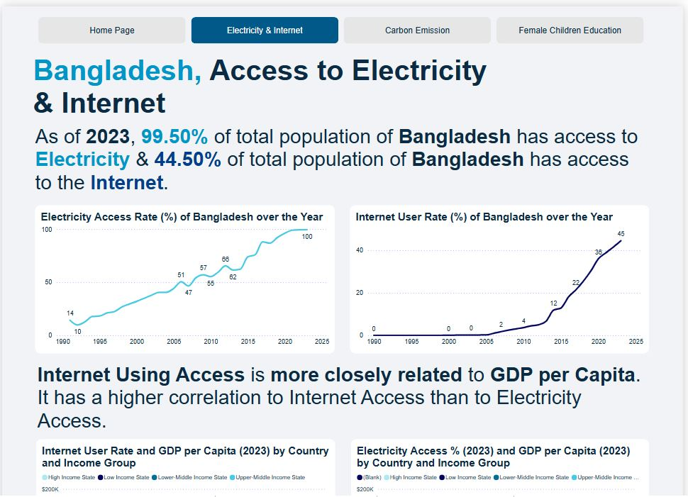

# 🌍 Power BI Monitoring System for Development Sectors

This Power BI project is a **data-driven monitoring and comparative analysis system** designed for Development Sector organizations like NGOs, World Bank, UNDP, and Humanitarian Agencies.

It allows users to interactively monitor, compare, and analyze key socio-economic indicators across countries, with a special focus on Bangladesh and global development trends.

---

## 🔍 Key Features

- ✅ **Advanced Map Visuals** with custom tooltips for country-level insights  
- ✅ **Country Segmentation** based on World Bank Income Classification  
- ✅ **KPI Cards** including Population, Land Area, GDP, etc.  
- ✅ **Trend Analysis** across multiple years for education, internet, and electricity access  
- ✅ **Correlation Dashboards** showing relationships between indicators (e.g. Female Education vs Infant Mortality)  
- ✅ **Ranking System** to show country standings across different metrics  
- ✅ **Comparative Visualizations** between Bangladesh and other countries

---

## 📊 Core Visuals

> The dashboard includes the following visual analytics:

1. Interactive world maps with income group overlays  
2. Female Education completion rate vs Internet Access correlation  
3. Carbon emission vs GDP per capita analysis  
4. National-level KPIs with global rankings  
5. Global country distribution based on income classification

---

## 📷 Screenshots

Below are visual previews from the Power BI dashboard (located in `/images` folder):

### Sample Previews

  
  
  
  
  
  
  
  
  
  

---

## 🔗 Live Dashboard

You can explore the full interactive Power BI dashboard here:  
👉 [**View Live Dashboard**](https://app.powerbi.com/view?r=eyJrIjoiN2YzODkwOTktMjllMy00ODEzLTlkYTItZGI5NTE3YmE2YjI0IiwidCI6IjFiMGY2ZDU2LTBkOTEtNDZiNy04NzFiLTBmNzljNzJhYmYxZiIsImMiOjEwfQ%3D%3D&pageName=c53eadf00c2599e1a256)

> *(Hosted on Power BI Service – no login required for view access)*

## 📂 Data Sources

- 🌐 **Female Primary Completion Rate**:  
  [World Bank – SE.PRM.CMPT.FE.ZS](https://data.worldbank.org/indicator/SE.PRM.CMPT.FE.ZS)

- 🌐 **Poverty Headcount ($3.00/day)**:  
  [World Bank – SI.POV.DDAY](https://data.worldbank.org/indicator/SI.POV.DDAY?locations=1W&start=1981&end=2023&view=chart)

- 🌐 **Carbon Dioxide Emissions (Mt CO₂)**:  
  [World Bank – EN.GHG.CO2.MT.CE.AR5](https://data.worldbank.org/indicator/EN.GHG.CO2.MT.CE.AR5?locations=1W&start=1960&end=2023&view=chart)

- 🌐 **Access to Electricity**:  
  [World Bank – EG.ELC.ACCS.ZS](https://data.worldbank.org/indicator/EG.ELC.ACCS.ZS?locations=1W&start=1990&end=2023&view=chart)

- 🌐 **Internet Usage**:  
  [World Bank – IT.NET.USER.ZS](https://data.worldbank.org/indicator/IT.NET.USER.ZS?locations=1W&start=1990&end=2023&view=chart)

- 🌐 **Global Country Dataset 2023** (Kaggle):  
  [Countries of the World – Kaggle](https://www.kaggle.com/datasets/nelgiriyewithana/countries-of-the-world-2023)

---

## 🚀 Use Case

This Power BI monitoring system can be used by:

- 📈 **Development practitioners** for real-time monitoring, planning, and evidence-based decision making  
- 🧠 **Policy analysts** to track socio-economic progress and assess development outcomes  
- 📊 **Analysts and researchers** to explore data trends, inter-indicator correlations, and global comparisons  
- 📚 **NGOs, humanitarian agencies, and advocacy groups** for data storytelling, stakeholder reporting, and impact communication

---
